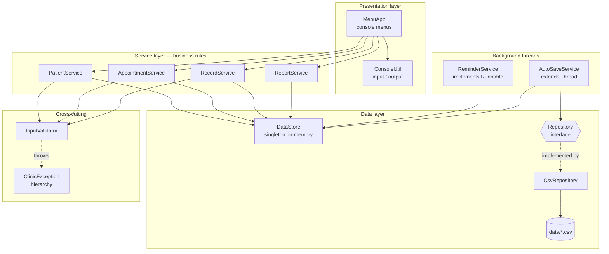
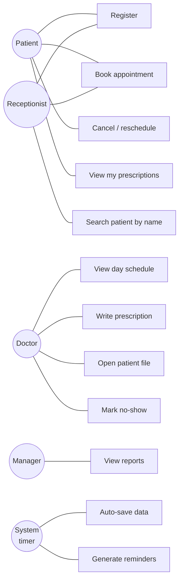
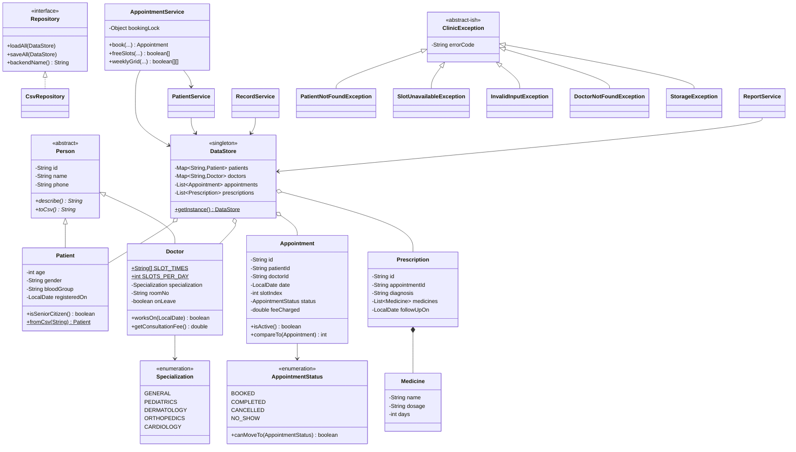
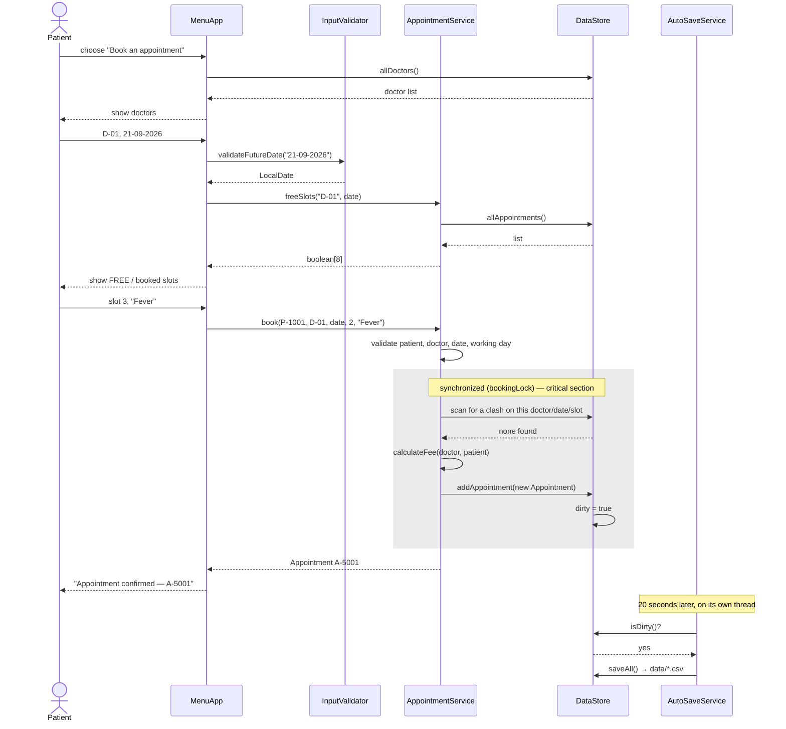
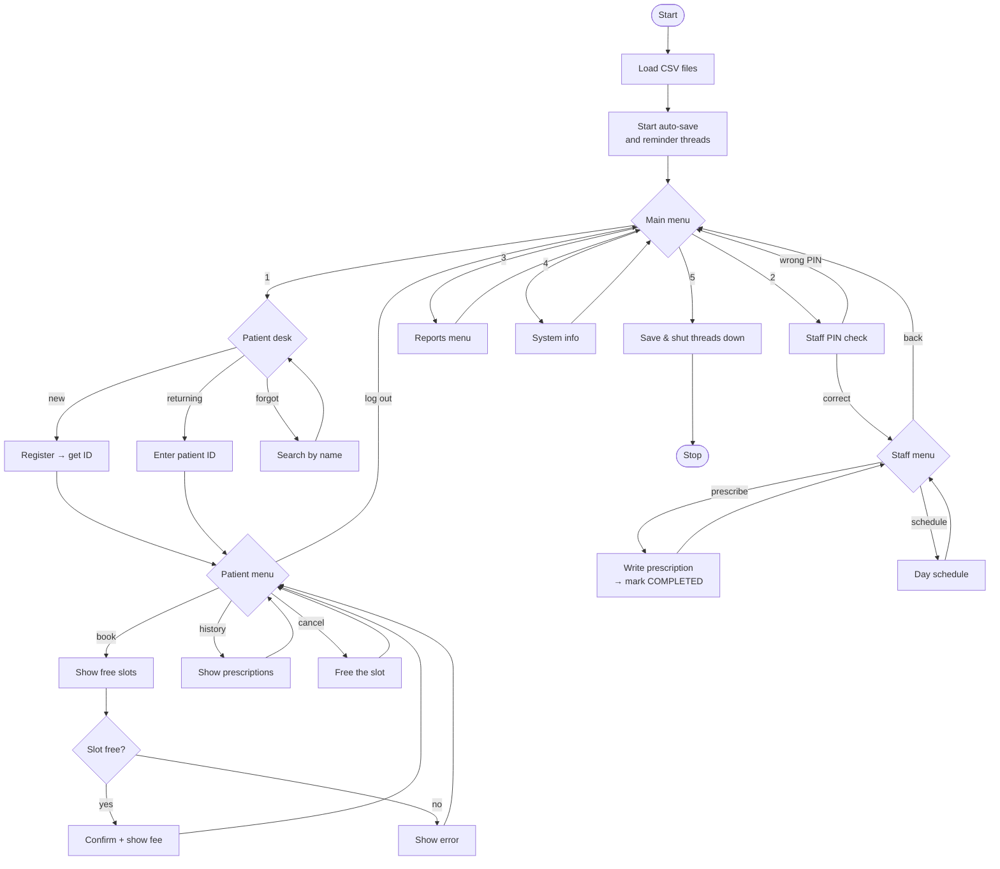
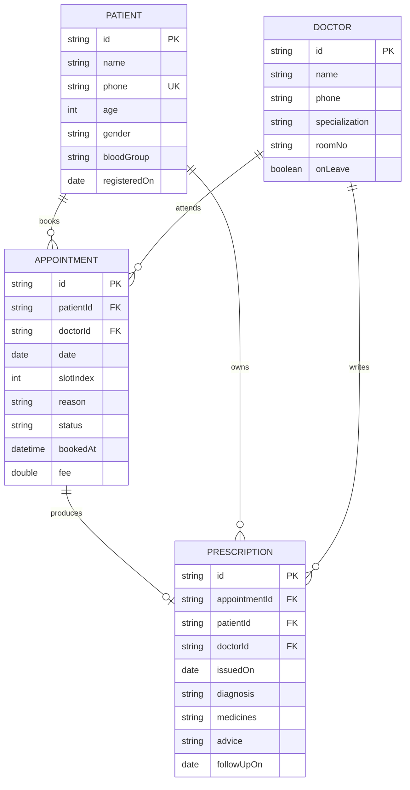

# ClinicCare — Design Document

All diagrams below are Mermaid. GitHub renders them automatically in the
repository, and they can be pasted into <https://mermaid.live> to export PNG or
SVG images for the PDF report.

---

## 1. System architecture

Four layers, each depending only on the layer below it. Nothing ever skips a
layer, and no layer ever calls upward.



**Why this shape.** The UI collects strings and prints results; it holds no
rules. Move the application to a web front end and the entire service layer is
reused untouched. Equally, `Repository` is the seam that lets CSV be replaced
by JDBC without any service class noticing.

---

## 2. Use case diagram



---

## 3. Class diagram



---

## 4. Sequence diagram — booking an appointment

The interesting part is the lock. Everything between `synchronized` and the
release is one indivisible step, which is what makes double booking impossible.



**Failure path.** If the scan finds a clash, `SlotUnavailableException` is
thrown from inside the lock, nothing is added, and `MenuApp` prints
`[ERR-409-SLOT] Slot 10:00 - 10:30 with Dr. Anita Rao on 2026-09-21 is already
booked.`

---

## 5. Workflow diagram



---

## 6. Storage design

### 6.1 ER diagram



### 6.2 Current implementation — CSV

Four files in `data/`. The first line of each is a `#` comment header, skipped
on load. A row that fails to parse is skipped rather than crashing the program,
so one corrupt line never costs the whole file.

```
data/patients.csv       P-1001,Ramesh Kumar,9876543210,34,M,B+,2026-09-17
data/doctors.csv        D-01,Dr. Anita Rao,9811100011,GENERAL,101,false
data/appointments.csv   A-5001,P-1001,D-01,2026-09-21,2,Fever,BOOKED,2026-09-17T17:29:27,300.0
data/prescriptions.csv  R-9001,A-5001,P-1001,D-01,2026-09-17,Viral Fever,Paracetamol 650|1-0-1|5,Rest,NONE
```

Medicines are packed into one cell as `name|dosage|days`, several separated by
`;`. Commas inside free text are replaced with `;` on write so they can never
break the column count.

### 6.3 The JDBC equivalent

Writing `JdbcRepository implements Repository` against this schema is the
natural next step; nothing else in the codebase would change.

```sql
CREATE TABLE patient (
    id            VARCHAR(10)  PRIMARY KEY,
    name          VARCHAR(40)  NOT NULL,
    phone         CHAR(10)     NOT NULL UNIQUE,
    age           INT          NOT NULL CHECK (age BETWEEN 0 AND 120),
    gender        CHAR(1)      NOT NULL,
    blood_group   VARCHAR(3)   NOT NULL,
    registered_on DATE         NOT NULL
);

CREATE TABLE doctor (
    id             VARCHAR(10) PRIMARY KEY,
    name           VARCHAR(40) NOT NULL,
    phone          CHAR(10)    NOT NULL,
    specialization VARCHAR(20) NOT NULL,
    room_no        VARCHAR(6),
    on_leave       BOOLEAN     NOT NULL DEFAULT FALSE
);

CREATE TABLE appointment (
    id         VARCHAR(10) PRIMARY KEY,
    patient_id VARCHAR(10) NOT NULL REFERENCES patient(id),
    doctor_id  VARCHAR(10) NOT NULL REFERENCES doctor(id),
    appt_date  DATE        NOT NULL,
    slot_index INT         NOT NULL CHECK (slot_index BETWEEN 0 AND 7),
    reason     VARCHAR(200),
    status     VARCHAR(12) NOT NULL,
    booked_at  TIMESTAMP   NOT NULL,
    fee        DECIMAL(8,2) NOT NULL
);

-- the database-level guarantee that mirrors the synchronized block:
CREATE UNIQUE INDEX uq_active_slot
    ON appointment (doctor_id, appt_date, slot_index)
    WHERE status = 'BOOKED';

CREATE TABLE prescription (
    id             VARCHAR(10) PRIMARY KEY,
    appointment_id VARCHAR(10) NOT NULL REFERENCES appointment(id),
    patient_id     VARCHAR(10) NOT NULL REFERENCES patient(id),
    doctor_id      VARCHAR(10) NOT NULL REFERENCES doctor(id),
    issued_on      DATE        NOT NULL,
    diagnosis      VARCHAR(120) NOT NULL,
    advice         VARCHAR(200),
    follow_up_on   DATE
);

CREATE TABLE prescription_medicine (
    prescription_id VARCHAR(10) NOT NULL REFERENCES prescription(id),
    line_no         INT         NOT NULL,
    medicine_name   VARCHAR(60) NOT NULL,
    dosage          VARCHAR(12) NOT NULL,
    days            INT         NOT NULL,
    PRIMARY KEY (prescription_id, line_no)
);
```

Note that `prescription_medicine` is a proper child table here, whereas the CSV
version packs it into one cell — that is exactly the normalisation a relational
store buys you.

---

## 7. Non-functional requirements

| # | Requirement | How it is met | Where to look |
|---|---|---|---|
| 1 | **Reliability** — no data loss on crash | Auto-save every 20s, a JVM shutdown hook, and atomic writes (temp file then rename) so a kill mid-write cannot destroy the previous good file | `AutoSaveService`, `CsvRepository.writeLines`, `Main` |
| 2 | **Correctness under concurrency** | All check-then-book logic sits in one `synchronized` block on a private lock; `DataStore` methods are synchronized; the shared reminder queue is guarded | `AppointmentService.book`, `DataStore`, `ReminderService` |
| 3 | **Error handling strategy** | Six typed exceptions with error codes; low-level `IOException` is wrapped in `StorageException`; the UI catches `ClinicException` at one point per action and never leaks a stack trace to the user | `exception/`, `MenuApp` |
| 4 | **Usability** | Free slots are shown before you are asked to pick one; the menu re-prompts instead of exiting on a bad number; every error message says exactly what to fix | `MenuApp.readChoice`, `InputValidator` |
| 5 | **Security** | Staff functions sit behind a PIN; a patient can only cancel or reschedule their own appointment; all input is validated against a whitelist pattern before storage | `MenuApp.staffDesk`, `AppointmentService.cancel`, `InputValidator` |
| 6 | **Maintainability** | Four layers, 23 single-responsibility classes, no business logic in the UI, storage behind an interface | whole project |
| 7 | **Performance** | Patient and doctor lookup is O(1) through a `HashMap`; slot availability is O(n) over appointments, which is negligible at clinic scale; the on-disk format is read once at start-up, not per query | `DataStore`, `AppointmentService.freeSlots` |
| 8 | **Resource efficiency** | Background threads are daemons that sleep between passes; saving is skipped entirely when the dirty flag is false; every stream is closed by try-with-resources | `AutoSaveService.saveIfDirty`, `CsvRepository` |

---

## 8. Design decisions and rationale

**Why is `DataStore` a singleton?**
Two copies of the clinic's data would be a correctness bug, not an
inconvenience: the auto-save thread would be persisting a different list from
the one the booking code writes to. One instance, created eagerly at class load,
removes the problem and the lazy-initialisation race along with it.

**Why a private lock object instead of `synchronized` methods?**
`synchronized` on a method locks `this`, and `this` is reachable by any caller.
A private `bookingLock` cannot be touched from outside, so no external code can
accidentally hold our lock and deadlock the booking path.

**Why is availability computed instead of stored?**
A cached `boolean[]` per doctor per day would be faster but can drift out of
sync with the appointment list after a cancel, a reschedule or a load from disk.
Deriving it from the single source of truth means it is always correct, and at
clinic scale the cost is invisible. This is a deliberate trade of speed for
correctness.

**Why checked exceptions rather than returning `null` or `false`?**
A booking can fail for six distinct reasons. A boolean return would collapse all
six into "no". A typed exception carries the reason, the error code and a
message written for the person reading the screen, and the compiler forces the
caller to deal with it.

**Why does writing a prescription auto-complete the appointment?**
Because the two facts cannot disagree in reality — a prescription exists only if
the consultation happened. Deriving the status removes a class of bug where
staff forget to update it.

**Why are cancelled appointments kept with fee 0 rather than deleted?**
Reports on cancellation rates need the row. Zeroing the fee keeps the recursive
revenue sum honest without a special case in the total.

**Why `AutoSaveService extends Thread` but `ReminderService implements Runnable`?**
Both approaches are on the syllabus and each is used where it fits.
`AutoSaveService` genuinely wants thread identity (naming, daemon status,
`join` on shutdown) so extending `Thread` is natural. `ReminderService` is a
task that also needs to be callable directly from a test, so implementing
`Runnable` keeps it independent of any thread.

---

## 9. Testing approach

`test/com/clinic/test/SelfTest.java` — a JUnit-free harness so the project has
no downloads and no build tool. 49 checks in 8 groups:

| Group | What it proves |
|---|---|
| Input validation | Bad phones, ages, blood groups and past dates are all rejected |
| Registration | IDs generate, duplicate phones are caught, unknown IDs raise the right exception, recursion counts seniors |
| Booking rules | Slot is consumed, double booking blocked, past dates blocked, unknown doctor blocked, Sunday blocked, senior discount applied, grid dimensions correct |
| **Concurrency** | 25 threads race for one slot — exactly 1 wins, 24 are rejected |
| Cancellation | Status changes, fee zeroes, slot frees, double-cancel refused, cross-patient cancel refused, reschedule moves the booking |
| Records | Prescription created, medicines parsed, appointment auto-completed, history retrievable, empty prescription refused |
| Reports | Per-doctor counts, busiest doctor, recursive revenue equals loop revenue, grid shape, age bands |
| Serialisation | Every entity survives a CSV round trip; a corrupt row returns `null` rather than crashing |

Run it with `java -cp out com.clinic.test.SelfTest`. It exits non-zero on
failure. Manual end-to-end runs additionally confirmed that data written in one
session is reloaded correctly in the next.

---

## 10. Challenges faced

1. **Proving the concurrency claim.** Asserting "it is thread-safe" is easy;
   showing it is not. The 25-thread race test was written first without the
   `synchronized` block, observed to produce multiple winners, and only then was
   the lock added — so the test is known to be capable of failing.
2. **Keeping availability consistent.** The first design cached free slots in a
   `Map`. A cancel-then-rebook sequence left the cache stale. Recomputing from
   the appointment list fixed a whole category of bugs at once.
3. **Commas inside free text.** A reason such as "fever, cough" silently shifted
   every later column on reload. Solved by escaping commas on write and by
   `split(",", -1)` with a length check plus a `null` return on a bad row.
4. **Background threads printing over the menu.** The reminder thread originally
   wrote straight to `System.out` and scribbled across whatever the user was
   reading. It now queues messages in a synchronized list that the UI drains at
   a safe moment.
5. **Threads keeping the JVM alive.** Early versions would not exit. Marking the
   background threads as daemons and adding a shutdown hook fixed it.

---

## 11. Future enhancements

- `JdbcRepository` against the schema in section 6.3, with the partial unique
  index enforcing slot uniqueness at the database level too
- Password hashing and real per-doctor logins instead of a shared PIN
- SMS or email delivery for the reminders that are currently only generated
- A JavaFX or web front end reusing the service layer unchanged
- Waiting list that auto-offers a slot when someone cancels
- Migration of the loops in `ReportService` to the Streams API

---

## 12. Syllabus concept map

Where to look for each concept when defending the project.

| Concept | File |
|---|---|
| Variables, data types, operators, I/O | `ConsoleUtil`, `Main` |
| if/else, switch, for, for-each, while, break, continue | `MenuApp` |
| Classes, objects, constructors, `this` | every model class |
| Access modifiers, encapsulation | `Person`, `Patient` |
| `final` keyword | `Person.id`, `Doctor.SLOT_TIMES` |
| Recursion | `PatientService.countSeniors`, `ReportService.sumFees` |
| `instanceof` | `Person.equals` |
| Inheritance, `super`, method overriding | `Patient`, `Doctor` extending `Person` |
| Abstract class and abstract method | `Person` |
| Interfaces | `Repository`, `Runnable`, `Comparable`, `Comparator` |
| Polymorphism (overloading and overriding) | `ClinicException` constructors; `describe()` calls in `MenuApp` |
| Static nested class | `Prescription.Medicine` |
| Anonymous class | the `Comparator` in `RecordService.historyOf` |
| Singleton | `DataStore` |
| Enum class, enum constructor, enum fields | `Specialization`, `AppointmentStatus` |
| Reflection | `ReflectionInspector`, System Info menu |
| Exceptions, try/catch/finally, throw/throws, multiple catch | `exception/`, `MenuApp`, `CsvRepository` |
| User-defined exceptions | all six classes in `exception/` |
| Thread creation (both ways), life cycle, sleep, interrupt, join | `AutoSaveService`, `ReminderService`, `Main` |
| Synchronization | `AppointmentService.bookingLock`, `DataStore`, `ReminderService` |
| User-defined packages | 7 packages under `com.clinic` |
| String classes and methods | `InputValidator`, all `toCsv` / `fromCsv` |
| 1-D arrays | `freeSlots()` returns `boolean[]` |
| 2-D arrays | `AppointmentService.weeklyGrid`, `ReportService.weeklyLoadGrid` |
| Collections Framework, List, ArrayList | `DataStore`, every service |
| Map / Set | `LinkedHashMap` in `DataStore`, `LinkedHashSet` in `RecordService` |
| Character-oriented streams, Reader/Writer | `CsvRepository` |
| JDBC | schema and migration path in section 6.3 |
